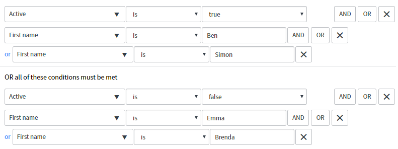

# Module for building ServiceNow encoded queries

Docs for formatting are [here](https://docs.servicenow.com/bundle/istanbul-servicenow-platform/page/use/using-lists/concept/c_EncodedQueryStrings.html)

## Usage

### Querying

To get a query string, you should add a query to the builder, then build it. The addQuery function will do a simple equals comparison when no comparator is provided.

```Javascript
var EncodedQueryBuilder = require('sn-encoded-query').EncodedQueryBuilder;
var builder = new EncodedQueryBuilder();
builder.addQuery('field','value');
builder.build(); // Returns field=value
```

To change the comparison type, put a comparator as the second parameter.

```Javascript
builder.addQuery('field',<comparator>,'value');
```

#### And

There are two ways to add an 'And' query. Both of these will render the same output.

```Javascript
builder.addQuery('first_name','Ben');
builder.addQuery('last_name','Knight');
// Result: first_name=Ben^last_name=Knight

builder.addQuery('first_name','Ben').and('last_name','Knight');
// Result: first_name=Ben^last_name=Knight
```

#### Or

There are two ways to add an 'Or' query, but they will give different results when built. This is to allow for more complex querys to be built.

```Javascript
builder.addQuery('first_name','Ben');
builder.addOrQuery('last_name','Knight');
// Result: first_name=Ben^NQlast_name=Knight

builder.addQuery('first_name','Ben').or('last_name','Knight');
// Result: first_name=Ben^ORlast_name=Knight
```

The difference in rendering is to allow for Or's for a single part of the query, or for larger sections. For example, say you need to find all active users named 'Ben' or 'Simon', as well as all inactive users named 'Emma' and 'Brenda', ServiceNow would show the following:



The same query is created below:

```Javascript
builder .addQuery('active','true')
        .and('first_name','Ben')
        .or('first_name','Simon');

builder .addOrQuery('active','false')
        .and('first_name','Emma')
        .or('first_name','Brenda');

// Result: active=true^first_name=Ben^ORfirst_name=Simon^NQactive=false^first_name=Emma^ORfirst_name=Brenda
```

### Order By

You can add on as many orderby clauses as you like. They will be prioritized by the order they were added.

```Javascript
var Direction = require('sn-encoded-query').Comparators.Direction;
builder.addOrderBy('field', Direction.Ascending);
```

### Group By

You can have one column specified to group by. If you add a second group by, it will override the first.

```Javascript
builder.addGroupBy('field');
```

### Comparators

The comparators are labeled the same as they are in ServiceNow. To use them you must require them and then pass them to the function.

```Javascript
var StartWith = require('sn-encoded-query').Comparators.StartWith;

builder.addQuery('field', StartsWith, 'val');
builder.build();
// Result: fieldSTARTSWITHval
```

The list of comparators are:

- Between
- DateLessThan
- DateMoreThan
- Direction
- Dynamic
- EndsWith
- GreaterThan
- GreaterThanField
- GreaterThanOrEqualsField
- GreaterThanOrEqualTo
- In
- Is
- IsAnything
- IsEmpty
- IsEmptyString
- IsNot
- IsNotEmpty
- IsNotSameAs
- IsSameAs
- LessThan
- LessThanField
- LessThanOrEqualsField
- LessThanOrEqualTo
- Like
- NotIn
- NotLike
- NotOn
- On
- Relative
- StartsWith
- Trend

#### Not Implemented

There are a few features that are not implemented yet. I have not yet come across a need for these yet but once I do I will add them in.

- Related List Queries
- SINCE
- MATCH_PAT
- MATCH_RGX
- INSTANCEOF
- VALCHANGES
- CHANGESFROM
- CHANGESTO
- sum
- avg
- min
- max

### Contributing

Feel free to fork then submit a pull request [here](https://github.com/benthomasknight/sn-encoded-query).